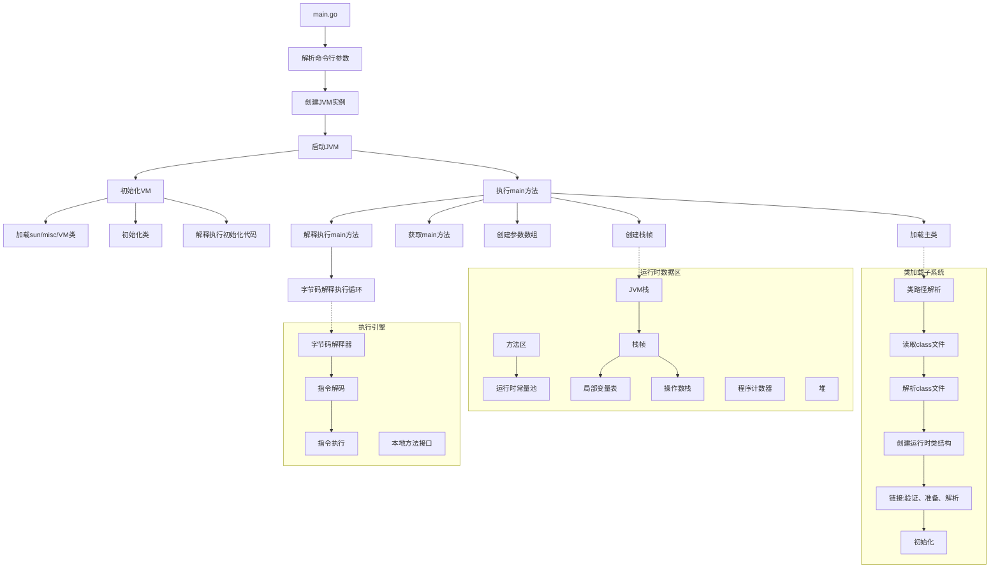
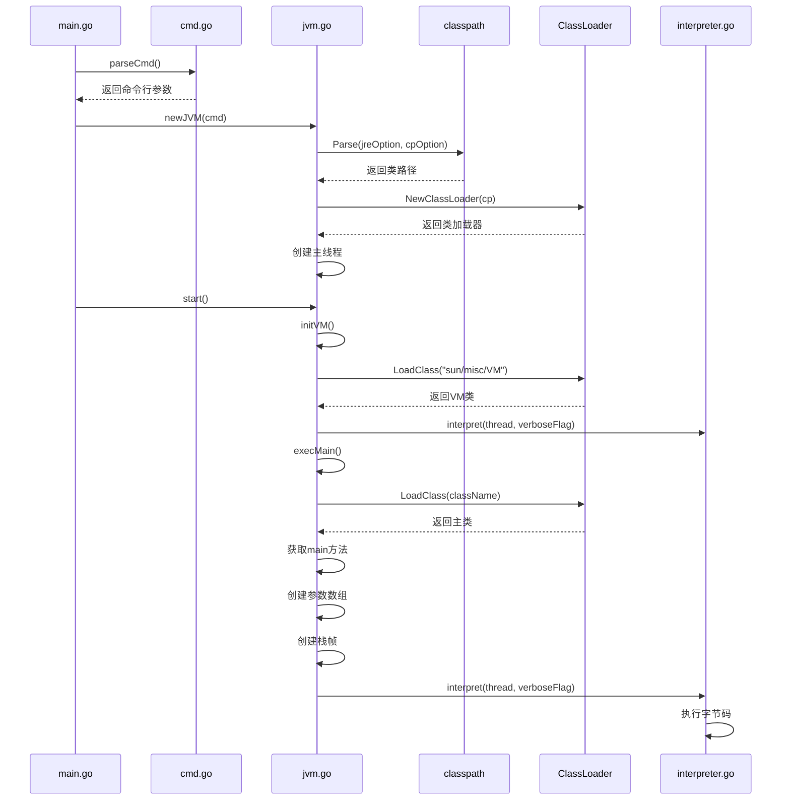
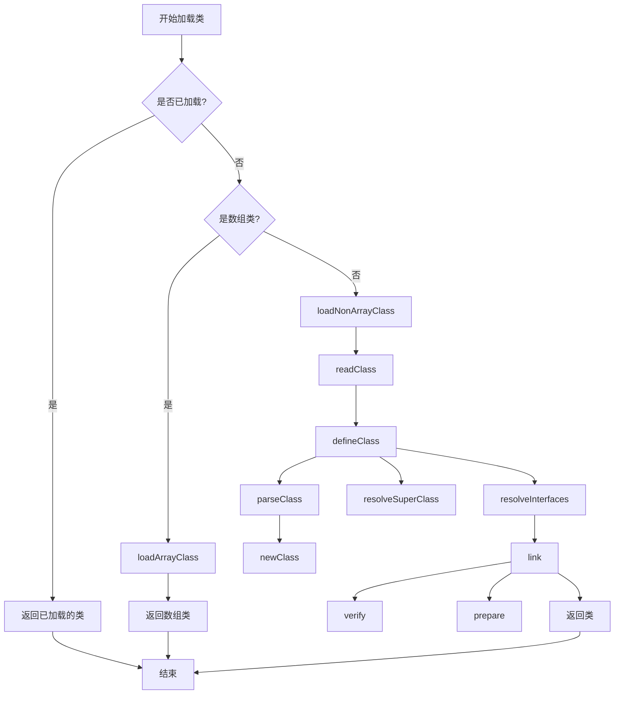
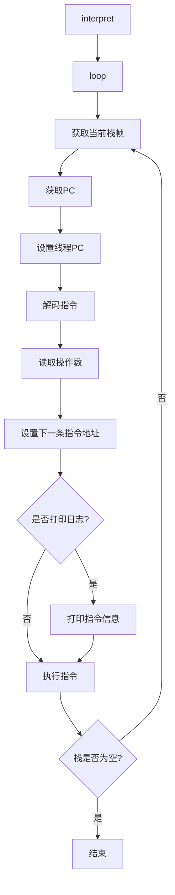
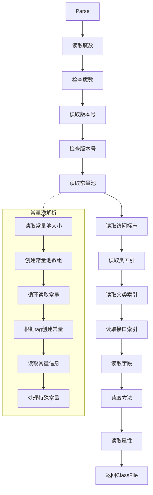
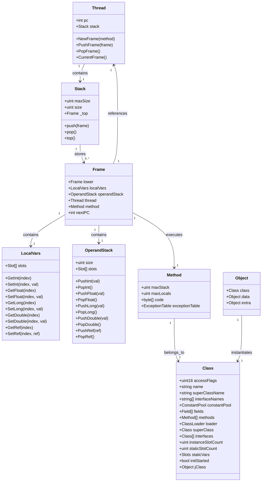
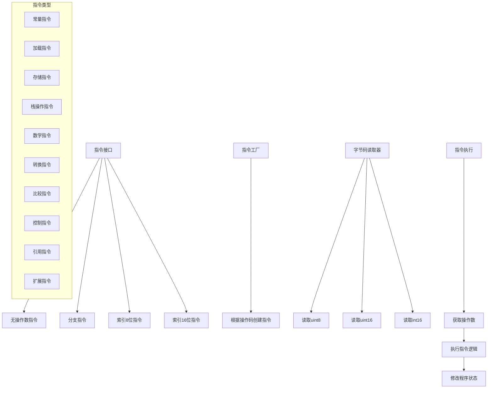
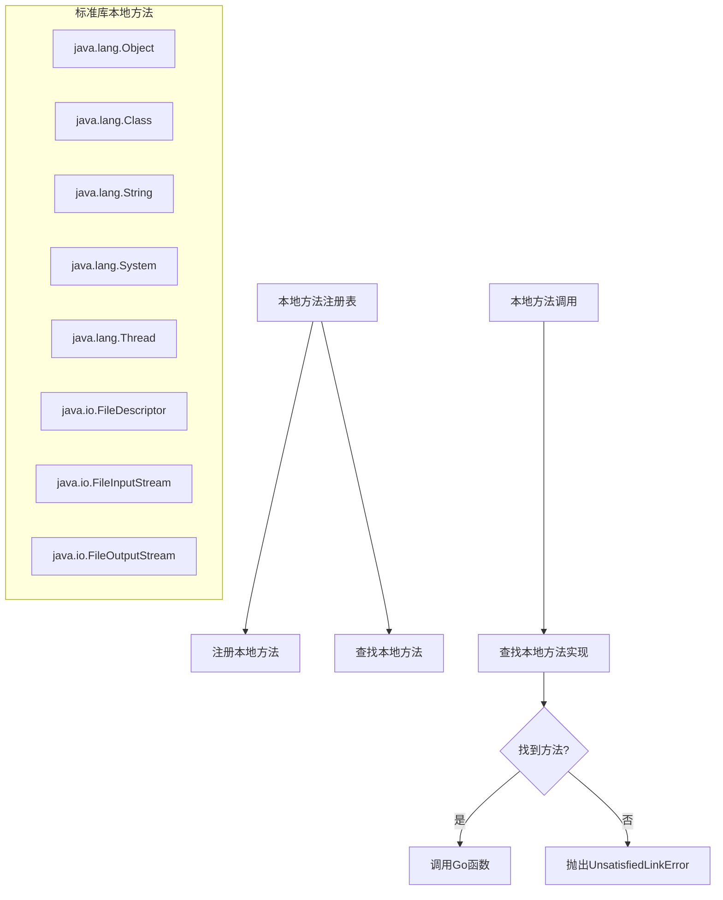

# JVM-Go 项目架构

## 整体架构图

下图展示了 JVM-Go 项目的整体架构，包括从启动到执行 Java 程序的完整流程。

**主要模块说明：**

1. **启动流程**：从 `main.go` 开始，解析命令行参数，创建 JVM 实例，然后启动 JVM。

2. **类加载子系统**：负责查找、加载、解析和初始化类文件。

3. **运行时数据区**：包括方法区、堆、JVM 栈、程序计数器等内存区域。

4. **执行引擎**：包含字节码解释器和本地方法接口，负责执行字节码指令。

## 启动流程

下图展示了 JVM 启动过程中各组件之间的交互。从命令行解析到最终执行 Java 程序的 main 方法。

**启动流程说明：**

1. **命令行解析**：`main.go` 调用 `cmd.go` 中的 `parseCmd()` 函数解析命令行参数。

2. **JVM 初始化**：创建 JVM 实例，解析类路径，创建类加载器和主线程。

3. **VM 初始化**：加载和初始化 `sun/misc/VM` 类，这是 Java 运行时的关键类。

4. **主类执行**：加载用户指定的主类，获取 `main` 方法，创建参数数组和栈帧，然后调用解释器执行字节码。

## 类加载流程

下图展示了类加载器的工作流程，包括类的加载、链接和初始化过程。

**类加载流程说明：**

1. **检查缓存**：首先检查类是否已经加载，如果已加载则直接返回。

2. **区分类型**：判断是否是数组类，如果是则调用 `loadArrayClass`，否则调用 `loadNonArrayClass`。

3. **加载非数组类**：
   - 读取类文件数据
   - 解析类文件
   - 创建运行时类结构
   - 解析父类和接口

4. **链接**：包括验证、准备和解析三个步骤。
   - 验证：检查类文件格式是否正确
   - 准备：为静态字段分配内存并设置默认值
   - 解析：将符号引用转换为直接引用

## 字节码执行流程

下图展示了字节码解释器的执行循环，从获取当前栈帧到执行指令的完整过程。

**字节码执行流程说明：**

1. **解释器初始化**：`interpret` 函数启动解释器，进入执行循环。

2. **执行循环**：
   - 获取当前栈帧（当前正在执行的方法的栈帧）
   - 获取并设置程序计数器（PC）
   - 解码当前指令，读取操作数
   - 设置下一条指令的地址
   - 根据需要打印指令信息
   - 执行当前指令

3. **循环终止条件**：当线程的栈为空时（所有方法都执行完毕），解释器结束执行。

## 类文件解析流程

下图展示了类文件的解析过程，从魔数验证到属性读取的完整流程。

**类文件解析流程说明：**

1. **魔数验证**：首先读取并验证类文件的魔数（`0xCAFEBABE`），确保文件格式正确。

2. **版本检查**：读取并验证类文件的版本号，确保它是支持的版本。

3. **常量池解析**：读取常量池大小，创建常量池数组，然后根据每个常量的标记（tag）创建相应类型的常量对象。

4. **类信息读取**：读取类的访问标志、类索引、父类索引和接口索引。

5. **成员信息读取**：读取类的字段、方法和属性信息。

6. **返回结果**：最终返回包含完整类信息的 `ClassFile` 结构体。

## 运行时数据区结构

运行时数据区是 JVM 在运行期间用于存储数据的内存区域，包括方法区、堆、JVM 栈、本地方法栈和程序计数器。在本项目中，我们使用 Go 的数据结构来模拟这些内存区域。

**关键组件说明：**

1. **Thread（线程）**：表示 JVM 的执行线程，每个线程有自己的程序计数器（PC）和 JVM 栈。

2. **Stack（栈）**：JVM 栈，用于存储栈帧。在我们的实现中，使用链表结构来模拟栈。

3. **Frame（栈帧）**：方法执行的基本单位，包含局部变量表、操作数栈和对当前方法的引用。

4. **LocalVars（局部变量表）**：用于存储方法的参数和局部变量。

5. **OperandStack（操作数栈）**：用于存储指令操作的临时数据。

6. **Class（类）**：表示已加载的类信息，包含类的常量池、字段、方法等信息。

7. **Method（方法）**：表示类中的方法，包含方法的字节码、局部变量表大小、操作数栈大小等信息。

8. **Object（对象）**：表示堆中的对象实例，包含对象的类型和实例数据。

## 指令执行模型

JVM 的指令执行模型是基于字节码解释器的。在我们的实现中，指令执行由以下组件完成：

**指令执行流程：**

1. **指令解码**：从当前方法的字节码中读取操作码（opcode）。
2. **创建指令**：根据操作码创建相应的指令对象。
3. **获取操作数**：如果指令需要操作数，从字节码中读取。
4. **执行指令**：执行指令的逻辑，可能会修改局部变量表、操作数栈或程序计数器。

**指令类型：**

我们实现了大部分 JVM 规范中定义的指令，包括常量指令、加载指令、存储指令、栈操作指令、数学指令、转换指令、比较指令、控制指令、引用指令和扩展指令。

## 本地方法接口

本地方法接口（Native Method Interface）允许 Java 代码调用非 Java 编写的方法。在我们的实现中，本地方法是用 Go 函数实现的。

**本地方法实现流程：**

1. **注册本地方法**：在 JVM 启动时，我们将 Go 函数注册到本地方法注册表中。

2. **调用本地方法**：当 Java 代码调用本地方法时，执行引擎会在注册表中查找相应的 Go 函数并执行。

3. **处理结果**：本地方法执行完成后，将结果返回给 Java 代码。

我们实现了多个标准库类的本地方法，如 `Object`、`String`、`System` 等，使得 JVM 可以执行基本的 Java 程序。
