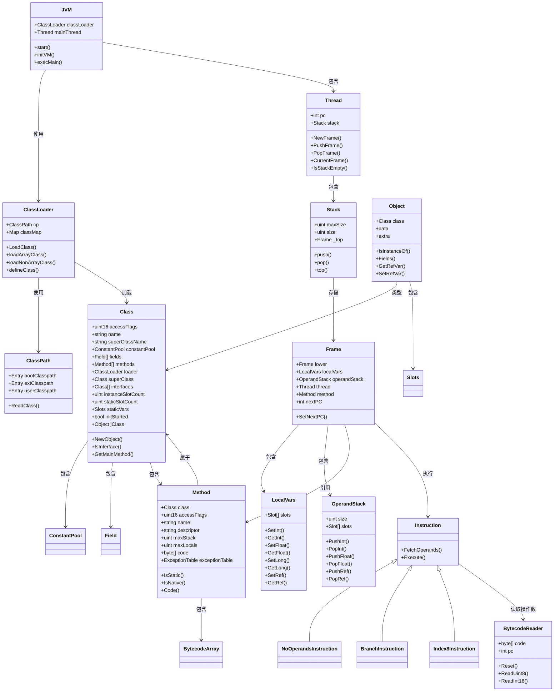
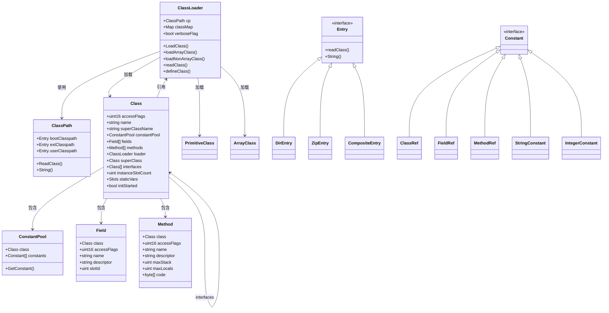
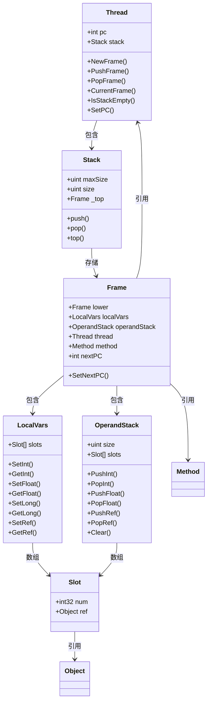
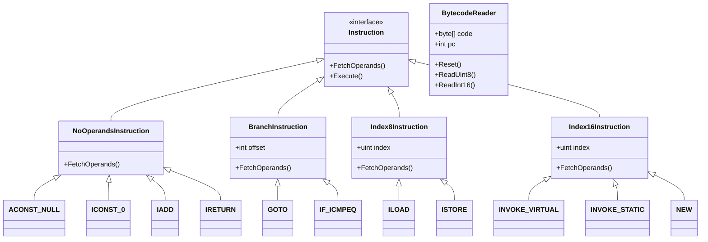
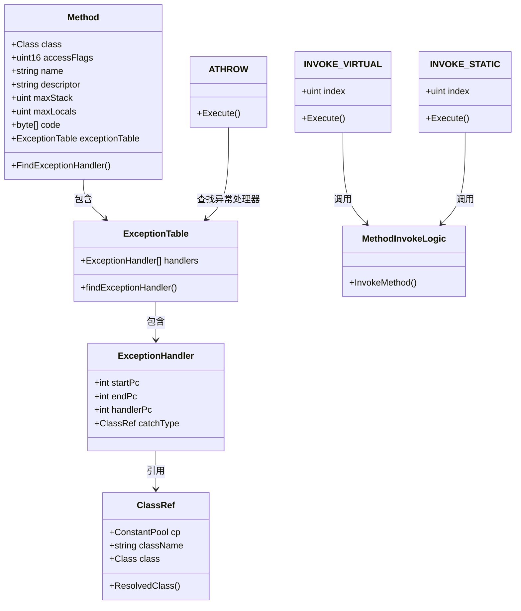
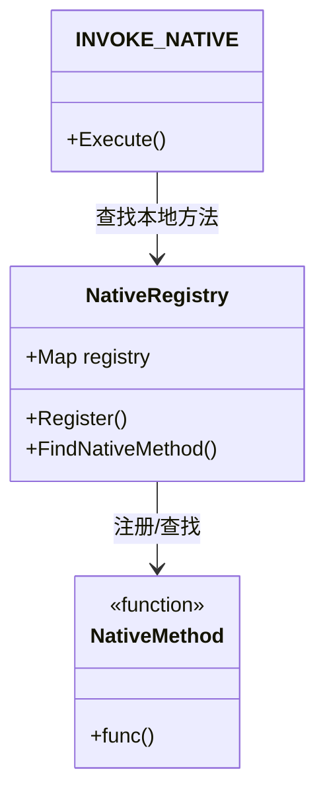

## JVM-Go 数据结构关系图

本文档详细展示JVM-Go实现中的数据结构及其关系，帮助理解Java虚拟机的内部工作原理。

### 整体架构关系图

下图展示JVM-Go的整体架构及主要组件之间的关系。JVM主要由类加载器、线程、运行时数据区和指令解释器组成。类加载器负责加载类，线程包含栈帧栈，每个栈帧对应一个方法调用，并包含局部变量表和操作数栈。

### 类加载子系统详细关系图

类加载子系统是JVM的核心组件之一，负责加载、链接和初始化类。下图展示了类加载器及其相关组件的结构。

ClassLoader类是类加载器的核心，它使用ClassPath来定位和读取类文件。ClassPath由多个Entry组成，包括DirEntry（目录）、ZipEntry（JAR文件）等。类加载器可以加载普通类、原始类型类和数组类。

每个Class对象包含常量池（ConstantPool）、字段（Field）和方法（Method）等信息。常量池存储类中使用的各种常量，如类引用、字段引用、方法引用等。

### 运行时数据区详细关系图

运行时数据区是JVM在运行期间用于存储数据的内存区域。下图展示了运行时数据区的组成及各组件之间的关系。

Thread（线程）是执行的基本单位，每个线程都有一个程序计数器（PC）和一个JVM栈（Stack）。Stack存储栈帧（Frame），每个栈帧对应一个方法调用。

Frame包含局部变量表（LocalVars）和操作数栈（OperandStack）。局部变量表用于存储方法的参数和局部变量，操作数栈用于存储指令操作的临时数据。两者都由槽（Slot）组成，每个槽可以存储一个整数或引用。

### 指令系统详细关系图

指令系统是JVM执行引擎的核心部分，负责解释执行字节码指令。下图展示了指令系统的结构及各类指令之间的关系。

JVM-Go实现了约200条JVM指令，所有指令都实现了Instruction接口，包含FetchOperands（读取操作数）和Execute（执行指令）两个方法。

指令按照其特性分为几类：
- NoOperandsInstruction：无操作数指令，如IADD（整数相加）、RETURN（返回空）等
- BranchInstruction：分支指令，如GOTO（无条件跳转）、IF_ICMPEQ（整数相等则跳转）等
- Index8Instruction：8位索引指令，如ILOAD（加载局部变量）等
- Index16Instruction：16位索引指令，如INVOKE_VIRTUAL（调用实例方法）等

BytecodeReader用于从字节码流中读取操作码和操作数。

### 方法调用与异常处理关系图

方法调用和异常处理是JVM执行模型的重要组成部分。下图展示了方法调用和异常处理的相关组件及其关系。

Method类包含方法的字节码和异常表（ExceptionTable）。异常表由多个异常处理器（ExceptionHandler）组成，每个处理器定义了一个代码范围（startPc到endPc）和对应的异常处理代码地址（handlerPc）。

ATHROW指令用于抛出异常，它会查找异常表中匹配的异常处理器。INVOKE_VIRTUAL和INVOKE_STATIC等指令用于调用方法，它们会使用MethodInvokeLogic来创建新的栈帧并传递参数。

### 本地方法接口关系图

本地方法接口（Native Method Interface）允许Java代码调用非Java编写的本地方法。下图展示了JVM-Go中本地方法接口的实现。

NativeMethod是一个函数类型，表示本地方法的实现。NativeRegistry用于注册和查找本地方法，它维护了一个映射表，将类名、方法名和方法描述符映射到对应的本地方法实现。

INVOKE_NATIVE指令用于调用本地方法，它会从注册表中查找对应的本地方法并执行。

JVM-Go实现了一些关键的本地方法，如java.lang.Object、java.lang.Class、java.lang.System等类中的本地方法。

## 总结

本文档详细展示了JVM-Go实现中的数据结构及其关系。通过这些图表和说明，我们可以看到Java虚拟机的内部结构和工作原理。

JVM-Go实现了JVM的核心功能，包括类加载、运行时数据区、指令解释执行、方法调用与返回、异常处理等。这些组件共同工作，实现了Java程序的执行环境。

通过研究JVM-Go的实现，我们可以更深入地理解Java虚拟机的工作原理，这对于优化Java程序性能、进行虚拟机开发和调试都有重要意义。
