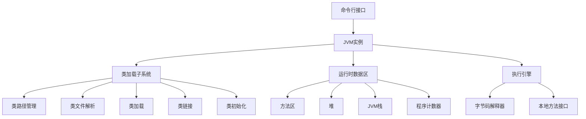
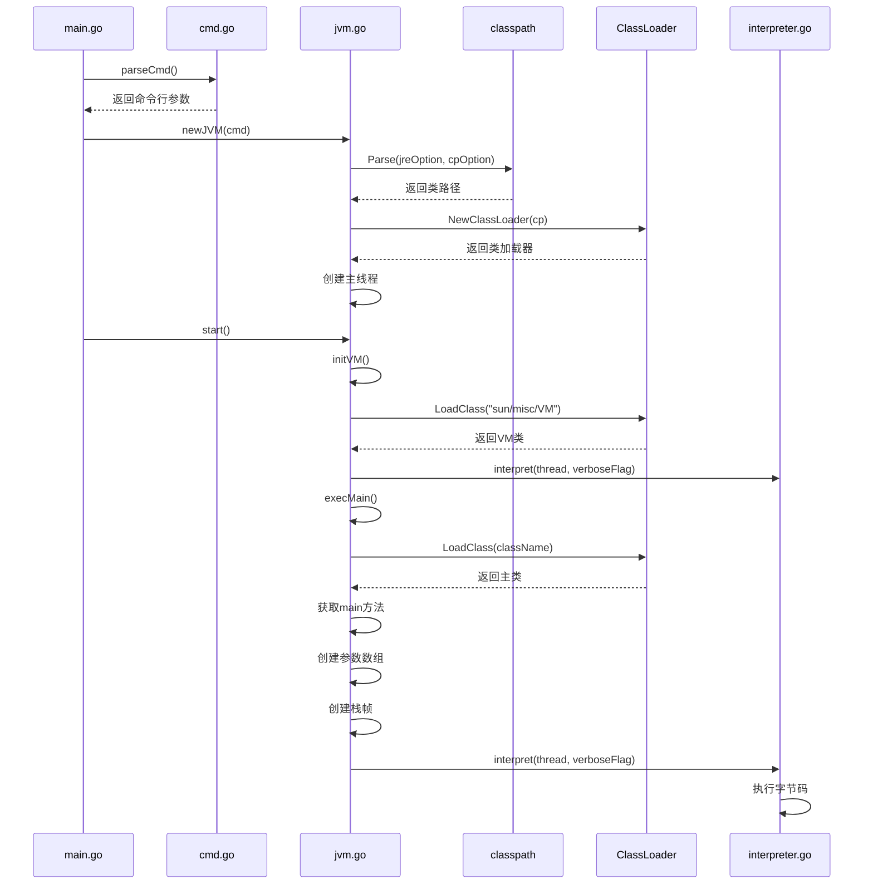
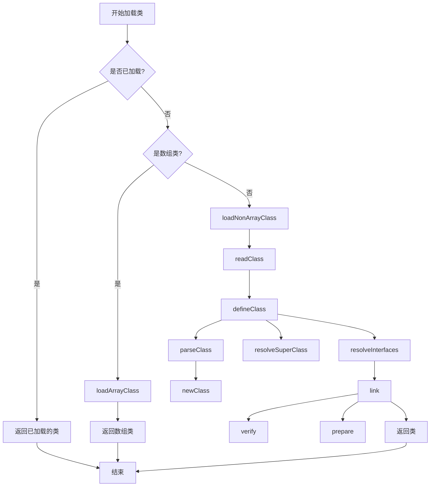
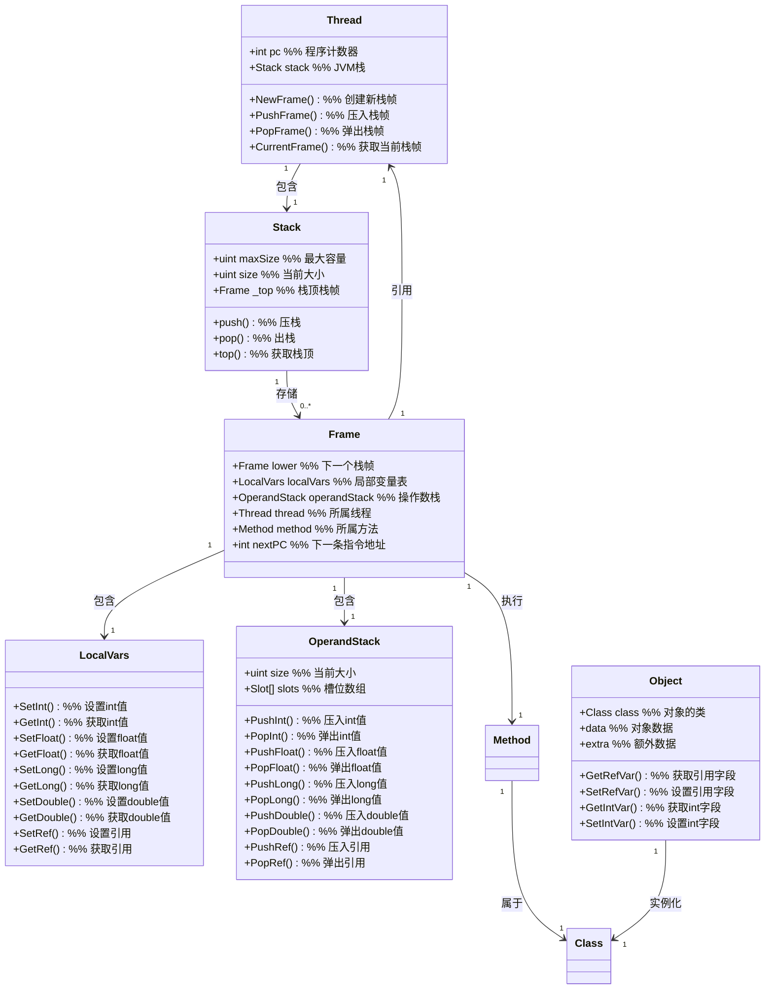
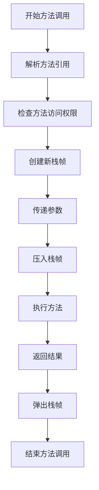
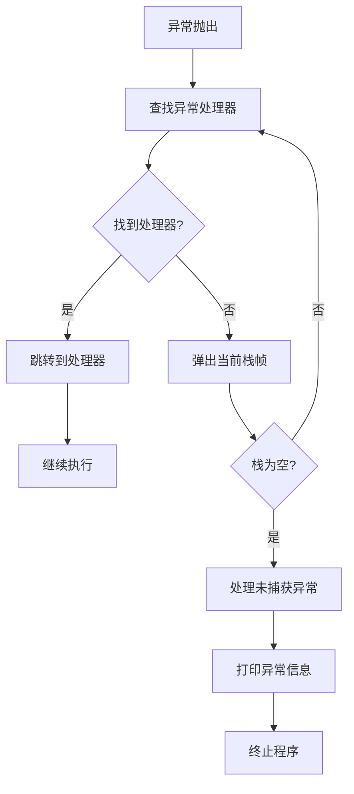
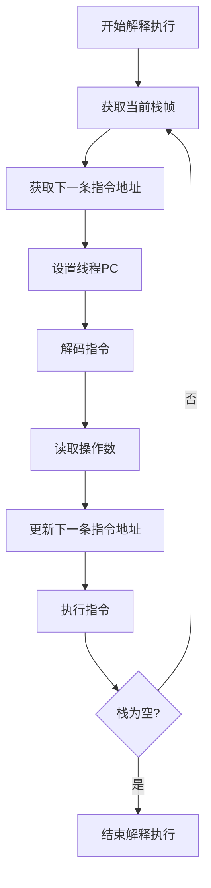

# JVM-Go: 用 Go 语言实现的 Java 虚拟机

本文档详细介绍了用 Go 语言实现的 Java 虚拟机（JVM-Go）的设计与实现。JVM-Go 实现了 Java 虚拟机的核心功能，包括类加载、运行时数据区、指令解释执行、方法调用与返回、异常处理等。

## 目录

1. [整体架构](#整体架构)
2. [命令行接口](#命令行接口)
3. [类加载器](#类加载器)
4. [运行时数据区](#运行时数据区)
5. [方法调用与返回](#方法调用与返回)
6. [异常处理](#异常处理)
7. [指令解释器](#指令解释器)
8. [本地方法接口](#本地方法接口)
9. [符号引用与解析](#符号引用与解析)

## 整体架构

JVM-Go 的整体架构遵循 Java 虚拟机规范，主要包括以下组件：



### 启动流程

JVM-Go 的启动流程如下：



## 命令行接口

命令行接口是用户与 JVM 交互的入口，负责解析命令行参数并启动 JVM。

### 命令行参数解析

命令行参数解析在 `cmd.go` 中实现，主要支持以下参数：

- `-help` 或 `-?`：打印帮助信息
- `-version`：打印版本信息
- `-verbose` 或 `-verbose:class`：启用类加载的详细输出
- `-verbose:inst`：启用指令执行的详细输出
- `-classpath` 或 `-cp`：指定类路径
- `-Xjre`：指定 JRE 路径

```go
type Cmd struct {
    helpFlag         bool     // -help 或 -? 选项，打印帮助信息
    versionFlag      bool     // -version 选项，打印版本信息并退出
    verboseClassFlag bool     // -verbose 或 -verbose:class 选项，启用类加载的详细输出
    verboseInstFlag  bool     // -verbose:inst 选项，启用指令执行的详细输出
    cpOption         string   // -classpath 或 -cp 选项，指定类路径
    XjreOption       string   // -Xjre 选项，指定JRE路径
    class            string   // 要执行的类名
    args             []string // 传递给main方法的参数
}
```

### JVM 启动

JVM 的启动在 `main.go` 和 `jvm.go` 中实现：

```go
func main() {
    cmd := parseCmd()
    if cmd.versionFlag {
        println("version 0.0.1")
    } else if cmd.helpFlag || cmd.class == "" {
        printUsage()
    } else {
        newJVM(cmd).start()
    }
}
```

`jvm.go` 中的 `start()` 方法负责初始化 JVM 并执行 main 方法：

```go
func (vm *JVM) start() {
    vm.initVM()   // 初始化虚拟机
    vm.execMain() // 执行 main 方法
}
```

## 类加载器

类加载器负责加载、链接和初始化类。JVM-Go 的类加载器在 `rtda/heap/class_loader.go` 中实现。

### 类加载器的原理

类加载器是JVM的核心组件，它实现了Java的动态加载机制。在Java中，类只有在需要时才会被加载，这种“按需加载”的机制提高了系统的效率。

类加载过程分为三个阶段：

1. **加载（Loading）**：查找类文件并解析成JVM内部的类结构。在JVM-Go中，这个过程包括从类路径中查找类文件，读取字节流，并解析成内部的`Class`结构。

2. **链接（Linking）**：将类与虚拟机运行时环境连接起来，包含三个子阶段：
   - **验证（Verification）**：确保类的结构和内容符合JVM规范。
   - **准备（Preparation）**：为类的静态字段分配内存并设置默认值。
   - **解析（Resolution）**：将类中的符号引用转换为直接引用。

3. **初始化（Initialization）**：执行类的初始化方法`<clinit>`，包括执行静态字段的赋值和静态代码块。

在JVM-Go中，类加载器还实现了以下重要特性：

- **类缓存**：使用`classMap`缓存已加载的类，避免重复加载。
- **数组类处理**：特殊处理数组类，包括基本类型数组和引用类型数组。
- **类的继承关系**：处理类的继承关系，包括超类和接口的解析。
- **基本类型类**：处理Java基本类型（int、boolean等）对应的类。

类加载器的设计体现了Java的“延迟加载”理念，只有在实际需要时才加载类，这样可以减少内存占用并提高启动速度。

### 类加载流程



### 类加载器实现

类加载器的核心是 `LoadClass` 方法，它负责加载类并缓存已加载的类：

```go
func (cl *ClassLoader) LoadClass(name string) *Class {
    // 检查类是否已经加载
    if class, ok := cl.classMap[name]; ok {
        return class
    }

    var class *Class
    if name[0] == '[' { // 判断是否是数组类
        class = cl.loadArrayClass(name)
    } else {
        class = cl.loadNonArrayClass(name)
    }

    // 为类创建 java.lang.Class 对象
    if jlClassClass, ok := cl.classMap["java/lang/Class"]; ok {
        class.jClass = jlClassClass.NewObject()
        class.jClass.extra = class
    }

    return class
}
```

这个方法实现了以下重要原理：

1. **类缓存机制**：首先检查类是否已经加载，如果已加载则直接返回缓存的类。这避免了重复加载，提高了效率。

2. **数组类的特殊处理**：根据类名的首字符判断是否是数组类。在Java中，数组类的名称以'['开头，如`[I`（int数组）、`[Ljava/lang/Object;`（Object数组）。数组类不需要从类文件加载，而是由JVM动态创建。

3. **java.lang.Class对象创建**：为每个加载的类创建一个`java.lang.Class`实例。在Java中，每个类都有一个对应的Class对象，用于表示类的元数据和支持反射操作。

对于非数组类，加载过程包括读取类文件、解析类文件、定义类和链接类：

```go
func (cl *ClassLoader) loadNonArrayClass(name string) *Class {
    data, entry := cl.readClass(name) // 读取类文件数据
    class := cl.defineClass(data)     // 定义类
    link(class)                       // 连接类

    if cl.verboseFlag {
        fmt.Printf("[Loaded %s from %s]\n", name, entry)
    }

    return class
}
```

这个方法实现了非数组类的加载过程：

1. **类文件查找与读取**：`readClass`方法使用类路径（ClassPath）来查找和读取类文件。类路径可以包含多个来源，如目录、JAR文件等。

2. **类定义**：`defineClass`方法将类文件的字节数据解析成内部的`Class`结构。这个过程包括解析常量池、字段、方法等信息。

3. **类链接**：`link`方法将类与虚拟机运行时环境连接起来。

链接过程包括验证和准备两个阶段：

```go
func link(class *Class) {
    verify(class)  // 验证类
    prepare(class) // 准备类
}
```

链接阶段的原理如下：

1. **验证（Verification）**：确保类的结构和内容符合JVM规范。在JVM-Go中，这个阶段相对简化，主要是为了实现的简洁性。完整的验证包括文件格式验证、元数据验证、字节码验证和符号引用验证等多个步骤。

2. **准备（Preparation）**：为类的静态字段分配内存并设置默认值。在JVM-Go中，这个过程包括计算实例字段和静态字段的数量，并为静态字段分配内存。默认值通常是零值，如int类型的默认值是0，引用类型的默认值是null。

值得注意的是，在准备阶段，只会设置默认值，而不会执行用户定义的初始化代码。用户定义的静态字段赋值和静态代码块会在后续的初始化阶段执行。

## 运行时数据区

运行时数据区是 JVM 在运行时用于存储数据的内存区域，包括方法区、堆、JVM 栈和程序计数器。

### 运行时数据区的原理

运行时数据区是JVM内存管理的核心部分，它定义了各种数据的存储区域及其组织方式。根据Java虚拟机规范，运行时数据区包含以下几个部分：

1. **程序计数器（Program Counter, PC）**：
   - 每个线程都有一个独立的PC寄存器
   - 存储当前正在执行的指令地址
   - 如果执行的是本地方法，PC值为空（undefined）

2. **Java虚拟机栈（JVM Stack）**：
   - 每个线程都有一个独立的JVM栈
   - 存储栈帧（Frame），每个栈帧对应一个方法调用
   - 栈帧包含局部变量表、操作数栈、动态链接等信息
   - 栈的大小可以固定或动态扩展

3. **本地方法栈（Native Method Stack）**：
   - 为本地方法服务的栈
   - 在JVM-Go中，简化实现，与JVM栈合并

4. **堆（Heap）**：
   - 所有线程共享的内存区域
   - 存储对象实例和数组
   - 由垃圾回收器管理（在JVM-Go中依赖Go的GC）

5. **方法区（Method Area）**：
   - 所有线程共享的内存区域
   - 存储类结构信息，如运行时常量池、字段和方法数据、方法和构造函数代码

6. **运行时常量池（Runtime Constant Pool）**：
   - 方法区的一部分
   - 存储类或接口的常量池表，包括各种字面量、符号引用等

在JVM-Go的实现中，运行时数据区的设计遵循以下原则：

1. **线程隔离**：每个线程都有自己的PC和栈，确保线程间的独立性。

2. **对象共享**：堆和方法区是所有线程共享的，允许线程间通过对象进行通信。

3. **内存管理效率**：通过合理的内存分配和回收机制，提高内存使用效率。

4. **栈帧复用**：当方法调用完成后，其栈帧会被释放，使得内存可以被复用。

### 数据区结构



### 线程与栈

线程是 JVM 的执行单元，每个线程有自己的程序计数器和 JVM 栈：

```go
type Thread struct {
    pc int    // 程序计数器
    stack *Stack // JVM 栈
}

func NewThread() *Thread {
    return &Thread{
        stack: newStack(1024),
    }
}
```

线程结构的设计原理：

1. **程序计数器（PC）**：
   - PC存储当前线程正在执行的指令地址
   - 在方法调用时，PC会被保存在栈帧中，并在方法返回时恢复
   - 当执行本地方法时，PC值不会更新

2. **栈（Stack）**：
   - 每个线程都有自己的JVM栈，用于存储方法调用的栈帧
   - 栈的大小在创建时指定（这里是1024），超过这个大小会抛出`StackOverflowError`
   - 栈的操作遵循后进先出（LIFO）原则

3. **线程状态管理**：
   - 在完整的JVM实现中，线程还包含状态信息（如运行、阻塞、等待等）
   - JVM-Go的实现相对简化，主要关注于执行模型

JVM 栈用于存储栈帧，每个栈帧对应一个方法调用：

```go
type Stack struct {
    maxSize uint   // 最大容量
    size    uint   // 当前大小
    _top    *Frame // 栈顶栈帧，栈使用链表实现
}

func (sta *Stack) push(frame *Frame) {
    if sta.size >= sta.maxSize {
        panic("java.lang.StackOverflowError")
    }

    if sta._top != nil {
        frame.lower = sta._top
    }

    sta._top = frame
    sta.size++
}
```

栈的实现原理：

1. **链表结构**：
   - 栈使用链表而非数组实现，每个栈帧通过`lower`字段指向下一个栈帧
   - 这种设计简化了栈帧的压入和弹出操作，只需要更新指针而不需要移动数据

2. **容量控制**：
   - 栈有最大容量限制，超过时会抛出`StackOverflowError`
   - 这模拟了真实JVM中的栈深度限制，防止无限递归导致的内存耗尽

3. **栈帧管理**：
   - 当新的方法被调用时，一个新的栈帧被压入栈顶
   - 当方法返回时，栈顶的栈帧被弹出
   - 这种机制确保了方法调用和返回的正确性

### 栈帧

栈帧是方法执行的基本单位，包含局部变量表、操作数栈和对当前方法的引用：

```go
type Frame struct {
    lower        *Frame          // 指向下一个栈帧，用于实现链表
    localVars    LocalVars       // 局部变量表
    operandStack *OperandStack   // 操作数栈
    thread       *Thread         // 所属线程
    method       *heap.Method    // 所属方法
    nextPC       int             // 下一条指令的地址
}
```

栈帧的设计原理：

1. **方法执行环境**：
   - 栈帧为每个方法调用创建一个独立的执行环境
   - 包含方法执行所需的所有数据，如局部变量、中间计算结果等

2. **链表结构**：
   - 栈帧通过`lower`字段形成链表，每个栈帧指向调用它的方法的栈帧
   - 这种结构支持方法调用的嵌套和返回

3. **执行状态维护**：
   - `nextPC`字段存储下一条要执行的指令地址
   - 当方法调用返回时，可以恢复到正确的执行位置

4. **数据存储与访问**：
   - 局部变量表（LocalVars）存储方法参数和局部变量
   - 操作数栈（OperandStack）用于存储指令执行的中间结果

5. **方法与线程引用**：
   - 栈帧存储对当前执行方法和线程的引用
   - 这使得栈帧可以访问方法的代码和其他信息，以及操作线程状态

### 局部变量表与操作数栈

局部变量表用于存储方法的参数和局部变量：

```go
type LocalVars []Slot

func (lv LocalVars) SetInt(index uint, val int32) {
    lv[index].num = val
}

func (lv LocalVars) GetInt(index uint) int32 {
    return lv[index].num
}
```

局部变量表的设计原理：

1. **槽位数组**：
   - 局部变量表本质上是一个`Slot`类型的数组
   - 每个槽位可以存储一个32位的数据（int、float、引用等）或者一个64位数据的一半（long、double占用两个槽位）

2. **参数传递**：
   - 当方法被调用时，参数会从调用者的操作数栈传递到被调用方法的局部变量表中
   - 对于实例方法，第0个槽位存储`this`引用

3. **类型特定的访问方法**：
   - 提供了不同类型的访问方法（SetInt/GetInt、SetFloat/GetFloat等）
   - 这些方法封装了对底层Slot结构的操作，提供了类型安全的接口

操作数栈用于存储指令操作的临时数据：

```go
type OperandStack struct {
    size  uint
    slots []Slot
}

func (osa *OperandStack) PushInt(val int32) {
    osa.slots[osa.size].num = val
    osa.size++
}

func (osa *OperandStack) PopInt() int32 {
    osa.size--
    return osa.slots[osa.size].num
}
```

操作数栈的设计原理：

1. **栈结构**：
   - 操作数栈是一个后进先出（LIFO）的数据结构
   - 使用`size`字段跟踪当前栈顶位置

2. **指令执行支持**：
   - JVM指令集是基于栈的，大多数指令从操作数栈中取出操作数，执行操作后将结果压回栈
   - 例如，`iadd`指令会从栈中弹出两个整数，相加后将结果压入栈

3. **类型特定的操作**：
   - 与局部变量表类似，操作数栈也提供了类型特定的压栈和出栈方法
   - 这些方法确保了数据操作的类型安全

4. **方法调用与返回**：
   - 在方法调用时，操作数栈用于传递参数
   - 在方法返回时，返回值被压入调用者的操作数栈

### 堆与对象

堆是用于存储对象实例的内存区域。在 JVM-Go 中，对象由 `Object` 结构体表示：

```go
type Object struct {
    class *Class            // 对象的类
    data  interface{}       // 对象的数据，对于普通对象是 Slots，对于数组是具体类型的切片
    extra interface{}       // 额外数据
}
```

对象的创建通过 `newObject` 方法实现：

```go
func newObject(class *Class) *Object {
    return &Object{
        class: class,
        data:  newSlots(class.instanceSlotCount),
    }
}
```

堆与对象的设计原理：

1. **对象结构**：
   - 每个对象都有一个指向其类的引用，用于获取类的元数据和方法
   - 对象的数据存储在`data`字段中，对于普通对象是槽位数组，对于数组是具体类型的切片
   - `extra`字段用于存储额外信息，如对于`java.lang.Class`对象，存储对应的Class结构

2. **对象创建**：
   - 对象创建时，根据类的`instanceSlotCount`分配实例字段的存储空间
   - 实例字段的数量在类加载时计算，包括继承自父类的字段

3. **对象访问**：
   - 对象的字段通过字段在槽位数组中的索引访问
   - 字段索引在类加载时计算并存储在字段结构中

4. **对象类型信息**：
   - 每个对象都持有对其类的引用，这使得可以在运行时进行类型检查
   - 这个设计支持了`instanceof`和`checkcast`等操作

5. **内存管理**：
   - 在JVM-Go中，对象的内存管理依赖于Go的垃圾回收机制
   - 实际的JVM实现中，堆管理是一个复杂的子系统，包括对象分配、垃圾回收和内存压缩等机制

## 方法调用与返回

方法调用是 JVM 执行的核心操作，包括方法解析、参数传递、栈帧创建和方法执行。

### 方法调用的原理

方法调用是Java程序执行的基本机制，它涉及多个重要原理：

1. **方法调用指令**：
   - JVM提供了不同类型的方法调用指令，对应不同的调用场景：
     - `invokestatic`：调用静态方法
     - `invokespecial`：调用实例初始化方法、私有方法和父类方法
     - `invokevirtual`：调用实例方法
     - `invokeinterface`：调用接口方法
     - `invokedynamic`：动态方法调用（JVM-Go中未完全实现）

2. **方法解析**：
   - 方法调用指令包含对常量池中方法符号引用的索引
   - 在执行时，需要将符号引用解析为实际的方法
   - 对于虚方法调用（invokevirtual和invokeinterface），还需要根据对象的实际类型确定要调用的方法实现

3. **动态分派**：
   - 对于虚方法调用，实际调用的方法在运行时根据对象的实际类型确定
   - 这是Java多态性的实现基础
   - 实现方式包括方法表查找、方法缓存等

4. **栈帧操作**：
   - 方法调用时创建新的栈帧
   - 将参数从调用者的操作数栈传递到被调用方法的局部变量表
   - 方法返回时弹出栈帧，并将返回值压入调用者的操作数栈

5. **方法调用类型**：
   - 直接调用：静态方法、私有方法、构造方法等，在编译时就可以确定
   - 虚方法调用：实例方法，需要在运行时根据对象类型动态确定
   - 接口方法调用：需要在运行时查找实现类中的方法
   - 本地方法调用：调用非Java实现的方法

### 方法调用流程



### 方法调用实现

方法调用的核心逻辑在 `instructions/base/method_invoke_logic.go` 中实现：

```go
func InvokeMethod(invokerFrame *rtda.Frame, method *heap.Method) {
    thread := invokerFrame.Thread()     // 获取当前线程
    newFrame := thread.NewFrame(method) // 为被调用的方法创建一个新的栈帧
    thread.PushFrame(newFrame)          // 将新的栈帧压入线程的栈

    // 传递参数
    argSlotCount := int(method.ArgSlotCount()) // 获取方法的参数槽数量
    if argSlotCount > 0 {
        // 将参数从调用者的操作数栈复制到被调用方法的局部变量表
        for i := argSlotCount - 1; i >= 0; i-- {
            slot := invokerFrame.OperandStack().PopSlot() // 从调用者的操作数栈弹出参数
            newFrame.LocalVars().SetSlot(uint(i), slot)   // 将参数设置到被调用方法的局部变量表
        }
    }
}
```

这个方法实现了方法调用的核心逻辑：

1. **栈帧创建与管理**：
   - 为被调用的方法创建新的栈帧
   - 将新栈帧压入线程的栈，使其成为当前栈帧

2. **参数传递机制**：
   - 计算方法参数所需的槽位数量（考虑到long和double占用两个槽位）
   - 从调用者的操作数栈中弹出参数，并设置到被调用方法的局部变量表中
   - 注意参数的顺序：从右到左弹出，从右到左设置

3. **执行环境切换**：
   - 这个过程实现了从调用者到被调用方法的执行环境切换
   - 当新栈帧成为当前栈帧后，执行就切换到了被调用的方法

JVM-Go 支持多种方法调用指令，包括：

- `invokestatic`：调用静态方法
- `invokespecial`：调用实例初始化方法、私有方法和父类方法
- `invokevirtual`：调用实例方法
- `invokeinterface`：调用接口方法
- `invokedynamic`：动态方法调用（JVM-Go 中未完全实现）

以 `invokevirtual` 为例，其实现如下：

```go
func (self *INVOKE_VIRTUAL) Execute(frame *rtda.Frame) {
    currentClass := frame.Method().Class()
    cp := currentClass.ConstantPool()
    methodRef := cp.GetConstant(self.Index).(*heap.MethodRef)
    resolvedMethod := methodRef.ResolvedMethod()

    // 检查方法是否为静态方法
    if resolvedMethod.IsStatic() {
        panic("java.lang.IncompatibleClassChangeError")
    }

    // 获取 this 引用
    ref := frame.OperandStack().GetRefFromTop(resolvedMethod.ArgSlotCount() - 1)
    if ref == nil {
        panic("java.lang.NullPointerException")
    }

    // 查找实际要调用的方法
    methodToBeInvoked := heap.LookupMethodInClass(ref.Class(),
                                                methodRef.Name(),
                                                methodRef.Descriptor())

    // 调用方法
    base.InvokeMethod(frame, methodToBeInvoked)
}
```

`invokevirtual`指令的实现展示了虚方法调用的关键原理：

1. **方法符号引用解析**：
   - 从常量池中获取方法符号引用
   - 将符号引用解析为实际的方法

2. **方法访问检查**：
   - 检查方法是否为静态方法，如果是则抛出异常
   - 检查this引用是否为null，如果是则抛出空指针异常

3. **动态方法查找**：
   - 根据对象的实际类型查找要调用的方法
   - 这是Java多态性的关键实现机制
   - `LookupMethodInClass`方法会在对象的类及其父类中查找匹配的方法

4. **方法调用**：
   - 找到实际要调用的方法后，使用`InvokeMethod`执行调用
   - 这个过程完成了从静态绑定到动态分派的转换

## 异常处理

异常处理是 JVM 的重要特性，包括异常的抛出、捕获和处理。

### 异常处理的原理

异常处理是Java程序处理错误的重要机制，它在JVM中的实现涉及以下原理：

1. **异常对象**：
   - 在Java中，异常是类型为`Throwable`及其子类的对象
   - 异常分为两大类：受检异常（`Exception`）和非受检异常（`Error`）
   - 异常对象包含错误信息和调用栈跟踪信息

2. **异常表**：
   - 每个方法都可以有一个异常表（Exception Table）
   - 异常表定义了代码中的受保护区域（try块）和异常处理器（catch块）
   - 每个异常处理条目包含：起始位置、结束位置、处理器位置和异常类型

3. **异常抛出机制**：
   - 异常可以通过`athrow`指令显式抛出（对应Java中的`throw`语句）
   - 也可以由JVM在运行时自动抛出（如空指针异常、数组越界等）

4. **异常查找机制**：
   - 当异常被抛出时，JVM会在当前方法的异常表中查找匹配的处理器
   - 如果找到匹配的处理器，就跳转到处理器位置执行
   - 如果当前方法没有匹配的处理器，就弹出当前栈帧，在调用者方法中继续查找

5. **调用栈展开**：
   - 如果异常没有在任何方法中被捕获，就会一直弹出栈帧直到线程的栈为空
   - 这时JVM会终止线程并打印异常信息和调用栈跟踪

6. **finally块处理**：
   - Java的`finally`块在编译时被转换为特殊的异常处理结构
   - 无论是正常执行还是发生异常，`finally`块都会被执行

### 异常处理流程



### 异常处理实现

异常处理的核心是 `athrow` 指令，它在 `instructions/references/athrow.go` 中实现：

```go
func (self *ATHROW) Execute(frame *rtda.Frame) {
    ex := frame.OperandStack().PopRef()
    if ex == nil {
        panic("java.lang.NullPointerException")
    }

    thread := frame.Thread()
    if !findAndGotoExceptionHandler(thread, ex) {
        handleUncaughtException(thread, ex)
    }
}
```

`athrow`指令的实现展示了异常处理的核心原理：

1. **异常对象获取**：
   - 从操作数栈中弹出异常对象
   - 检查异常对象是否为null，如果是则抛出空指针异常

2. **异常处理器查找**：
   - 调用`findAndGotoExceptionHandler`方法查找匹配的异常处理器
   - 如果找到处理器，则跳转到处理器位置继续执行
   - 如果没有找到处理器，则处理未捕获异常

查找异常处理器的逻辑如下：

```go
func findAndGotoExceptionHandler(thread *rtda.Thread, ex *heap.Object) bool {
    for {
        frame := thread.CurrentFrame()
        pc := frame.NextPC() - 1

        handlerPC := frame.Method().FindExceptionHandler(ex.Class(), pc)
        if handlerPC > 0 {
            stack := frame.OperandStack()
            stack.Clear()
            stack.PushRef(ex)
            frame.SetNextPC(handlerPC)
            return true
        }

        thread.PopFrame()
        if thread.IsStackEmpty() {
            break
        }
    }
    return false
}
```

这个方法实现了异常处理器的查找和调用栈展开机制：

1. **当前方法异常处理器查找**：
   - 获取当前栈帧和异常发生时的PC值
   - 在当前方法的异常表中查找匹配的异常处理器

2. **异常处理器执行准备**：
   - 如果找到处理器，清空操作数栈
   - 将异常对象压入操作数栈（作为catch块的参数）
   - 设置下一条指令的地址为异常处理器的地址

3. **调用栈展开**：
   - 如果当前方法没有匹配的异常处理器，弹出当前栈帧
   - 在调用者方法中继续查找异常处理器
   - 如果栈为空（即所有方法都没有处理器），返回false

异常表的实现在 `rtda/heap/exception_table.go` 中：

```go
func (self ExceptionTable) findExceptionHandler(exClass *Class, pc int) *ExceptionHandler {
    for _, handler := range self {
        // jvms: The start_pc is inclusive and end_pc is exclusive
        if pc >= handler.startPc && pc < handler.endPc {
            if handler.catchType == nil {
                return handler
            }
            catchClass := handler.catchType.ResolvedClass()
            if catchClass == exClass || catchClass.IsSuperClassOf(exClass) {
                return handler
            }
        }
    }
    return nil
}
```

异常表的实现展示了异常处理器的匹配原理：

1. **代码范围匹配**：
   - 首先检查异常发生的PC是否在异常处理器的保护范围内
   - 起始位置是包含的，结束位置是不包含的

2. **异常类型匹配**：
   - 如果`catchType`为null，表示这是一个`finally`块，可以匹配任何异常
   - 否则检查抛出的异常类型是否是处理器指定类型或其子类

3. **异常处理器优先级**：
   - 异常表中的处理器按照定义顺序检查
   - 这确保了Java代码中先定义的catch块先匹配

## 指令解释器

指令解释器是 JVM 的核心组件，负责解释执行字节码指令。

### 指令解释器的原理

指令解释器是JVM执行引擎的核心部分，负责解释和执行字节码指令。它的工作原理如下：

1. **基于栈的指令集**：
   - Java字节码是一种基于栈的指令集，大多数指令从操作数栈中取出操作数，执行操作后将结果压回栈
   - 与基于寄存器的指令集相比，基于栈的指令集更紧凑，更适合跨平台

2. **指令的结构**：
   - 每条指令由操作码（opcode）和操作数（operands）组成
   - 操作码是一个字节，表示要执行的操作类型
   - 操作数的数量和类型由操作码决定

3. **指令的分类**：
   - 根据功能分类：加载和存储指令、算术指令、类型转换指令、对象创建与操作指令、操作数栈管理指令、控制转移指令、方法调用与返回指令等
   - 根据操作数分类：无操作数指令、分支指令、单字节索引指令、双字节索引指令等

4. **指令执行周期**：
   - 取得操作码（Fetch）：从当前方法的字节码中获取下一条指令的操作码
   - 解码（Decode）：根据操作码确定指令类型和操作数长度
   - 获取操作数（Fetch Operands）：从字节码中读取操作数
   - 执行（Execute）：执行指令的操作
   - 更新PC：更新程序计数器指向下一条指令

5. **解释器循环**：
   - 解释器在一个循环中不断执行上述指令执行周期
   - 循环继续直到方法返回或抛出异常

### 指令执行流程



### 指令解释器实现

指令解释器的核心是 `loop` 方法，它在 `interpreter.go` 中实现：

```go
func loop(thread *rtda.Thread, logInst bool) {
    reader := &base.BytecodeReader{} // 字节码读取器
    for {
        frame := thread.CurrentFrame() // 获取当前栈帧
        pc := frame.NextPC()           // 获取下一条指令的地址
        thread.SetPC(pc)               // 设置线程的程序计数器

        // 解码指令
        reader.Reset(frame.Method().Code(), pc)     // 重置字节码读取器
        opcode := reader.ReadUint8()                // 读取操作码
        inst := instructions.NewInstruction(opcode) // 创建指令
        inst.FetchOperands(reader)                  // 读取操作数
        frame.SetNextPC(reader.PC())                // 更新下一条指令的地址

        // 执行指令
        inst.Execute(frame)

        // 如果栈为空，则退出循环
        if thread.IsStackEmpty() {
            break
        }
    }
}
```

`loop`方法实现了指令解释器的核心循环，它的设计体现了以下重要原理：

1. **指令获取与解码**：
   - 从当前栈帧获取下一条指令的地址（PC）
   - 重置字节码读取器，指向当前方法的字节码和PC位置
   - 读取操作码并创建相应的指令对象
   - 读取指令的操作数

2. **PC更新机制**：
   - 在执行指令之前就计算好了下一条指令的地址
   - 这样即使当前指令不修改PC，下一轮循环也能正确找到下一条指令
   - 对于需要修改控制流的指令（如跳转、方法调用），可以在执行过程中调用`SetNextPC`来覆盖预设的下一条指令地址

3. **指令执行**：
   - 每个指令都实现了`Execute`方法，定义了指令的具体行为
   - 指令执行可能会修改操作数栈、局部变量表、堆中的对象等
   - 某些指令（如方法调用、返回、跳转）会改变控制流

4. **循环终止条件**：
   - 当线程的栈为空时，表示所有方法都已执行完毕，解释器循环终止
   - 这通常意味着程序执行结束

5. **模块化设计**：
   - 指令的解码和执行被分离，使得每个指令只需关注自己的执行逻辑
   - 这种设计提高了代码的模块化和可维护性

### 指令集实现

JVM-Go 实现了约 200 条 JVM 指令，每条指令都实现了 `Instruction` 接口：

```go
type Instruction interface {
    FetchOperands(reader *BytecodeReader)
    Execute(frame *rtda.Frame)
}
```

这个接口定义了所有指令必须实现的两个方法：

1. **FetchOperands**：从字节码中读取指令的操作数
2. **Execute**：执行指令的操作

指令按照其特性分为几类，如无操作数指令、分支指令、索引指令等：

```go
type NoOperandsInstruction struct {}
type BranchInstruction struct { Offset int }
type Index8Instruction struct { Index uint }
type Index16Instruction struct { Index uint }
```

这些基础类型实现了不同类型指令的共同行为：

1. **NoOperandsInstruction**：无操作数指令，如`iadd`、`ireturn`等
2. **BranchInstruction**：分支指令，包含一个偏移量，用于计算跳转目标
3. **Index8Instruction**：单字节索引指令，如`iload_0`、`istore_1`等
4. **Index16Instruction**：双字节索引指令，如`invokevirtual`、`getfield`等

以 `iadd` 指令为例，它是一个无操作数的指令，用于将操作数栈上的两个整数相加：

```go
type IADD struct{ base.NoOperandsInstruction }

func (self *IADD) Execute(frame *rtda.Frame) {
    stack := frame.OperandStack()
    v2 := stack.PopInt()
    v1 := stack.PopInt()
    result := v1 + v2
    stack.PushInt(result)
}
```

这个简单的指令展示了JVM指令的基本工作原理：

1. **操作数栈操作**：从操作数栈中弹出操作数，执行操作后将结果压回栈
2. **类型特定的操作**：每个指令都针对特定类型的数据进行操作，如`iadd`针对整数，`fadd`针对浮点数
3. **栈帧上下文**：指令在当前栈帧的上下文中执行，可以访问局部变量表和操作数栈

## 本地方法接口

本地方法接口允许 Java 代码调用本地（native）方法。JVM-Go 实现了部分关键的本地方法。

### 本地方法接口的原理

本地方法接口（Native Method Interface）是JVM的重要组成部分，它允许Java代码与非Java代码（如C、C++等语言编写的代码）之间进行交互。它的工作原理如下：

1. **本地方法声明**：
   - 在Java代码中，本地方法使用`native`关键字声明，但没有方法体
   - 这些方法的实现在Java代码外部，通常用C或C++编写

2. **本地方法注册**：
   - 本地方法需要在JVM中注册，建立本地方法与Java方法声明之间的映射关系
   - 在真实JVM中，这通常通过JNI（Java Native Interface）实现

3. **本地方法调用**：
   - 当Java代码调用本地方法时，JVM会查找并执行相应的本地实现
   - 调用过程包括参数传递、类型转换和返回值处理

4. **应用场景**：
   - 访问底层系统资源（如文件系统、网络、硬件等）
   - 实现高性能的计算密集型任务
   - 集成现有的非Java库和系统

在JVM-Go中，本地方法接口的实现相对简化，主要目的是支持Java标准库中的关键本地方法，而不是提供完整的JNI功能。

### 本地方法注册

本地方法通过 `native.Register` 函数注册：

```go
func init() {
    native.Register("sun/misc/VM", "initialize", "()V", initialize)
}
```

本地方法注册的原理：

1. **注册机制**：
   - JVM-Go使用一个映射表来存储本地方法的注册信息
   - 每个本地方法由类名、方法名和方法描述符唯一标识
   - 注册时将本地方法的Go实现与这个唯一标识关联起来

2. **初始化时注册**：
   - 本地方法通常在`init()`函数中注册，确保JVM启动时就可用
   - 这些方法按照包和类组织，每个包或类的本地方法在各自的文件中注册

3. **方法签名**：
   - 方法描述符（如`()V`）定义了方法的参数类型和返回类型
   - 这确保了本地方法的类型安全性，与Java方法声明保持一致

### 本地方法调用

本地方法的调用通过 `invokenative` 指令实现：

```go
func (n *INVOKE_NATIVE) Execute(frame *rtda.Frame) {
    method := frame.Method()
    className := method.Class().Name()
    methodName := method.Name()
    methodDescriptor := method.Descriptor()

    nativeMethod := native.FindNativeMethod(className, methodName, methodDescriptor)
    if nativeMethod == nil {
        methodInfo := className + "." + methodName + methodDescriptor
        panic("java.lang.UnsatisfiedLinkError: " + methodInfo)
    }

    nativeMethod(frame)
}
```

本地方法调用的原理：

1. **方法查找**：
   - 从当前栈帧中获取方法信息（类名、方法名和描述符）
   - 使用这些信息从注册表中查找对应的本地方法实现
   - 如果找不到匹配的本地方法，抛出`UnsatisfiedLinkError`异常

2. **方法执行**：
   - 将当前栈帧传递给本地方法
   - 本地方法可以通过栈帧访问局部变量表和操作数栈，从而与Java代码交互

3. **参数与返回值处理**：
   - 本地方法从局部变量表中获取参数
   - 返回值通过操作数栈传递回调用者

4. **异常处理**：
   - 本地方法可以创建和抛出Java异常
   - 这些异常会被正常的JVM异常处理机制捕获和处理

在JVM-Go中，本地方法的实现主要包括一些关键的Java标准库方法，如`System.arraycopy()`、`Object.getClass()`、`Class.getPrimitiveClass()`等。这些方法对于Java程序的正常运行是必不可少的。

## 符号引用与解析

符号引用是Java虚拟机中一个核心概念，它在类加载、链接和执行过程中起着至关重要的作用。本节将详细介绍符号引用的概念、实现和应用场景，这些知识在Java开发和JVM相关面试中经常被问到。

### 符号引用的概念

符号引用（Symbolic Reference）是Java类文件中对其他类、接口、字段、方法的引用方式，它使用全限定名或描述符等符号信息来表示被引用的实体，而不是使用直接的内存地址或偏移量。

在JVM中，符号引用主要存在于类文件的常量池中，包括以下几种类型：

1. **类或接口的符号引用**：通过全限定名引用另一个类或接口
2. **字段的符号引用**：包含字段所属的类名、字段名和字段描述符
3. **方法的符号引用**：包含方法所属的类名、方法名和方法描述符

### 为什么需要符号引用

符号引用的存在有几个重要原因：

1. **支持类的动态加载和链接**

   Java采用动态加载机制，类只有在需要时才会被加载。如果使用直接引用（如内存地址），那么所有被引用的类都必须在编译时就确定位置，这与Java的动态加载特性相矛盾。

2. **平台无关性**

   Java的“一次编译，到处运行”特性要求类文件格式与具体平台无关。符号引用使用平台无关的方式来表示引用关系，而不依赖于特定平台的内存布局。

3. **支持类的版本演进**

   使用符号引用而非直接引用，使得类可以独立演进。只要保持接口兼容性，一个类的实现可以改变而不影响引用它的其他类。

4. **支持运行时绑定**

   符号引用为Java的多态性和动态绑定提供了基础。通过符号引用，JVM可以在运行时根据对象的实际类型确定要调用的方法实现。

### 符号引用的实现

在JVM-Go中，符号引用主要通过以下类来实现：

```go
// 类引用
type ClassRef struct {
    cp        *ConstantPool // 所属常量池
    className string        // 类名
    class     *Class        // 解析后的类
}

// 字段引用
type FieldRef struct {
    MemberRef
    field *Field // 解析后的字段
}

// 方法引用
type MethodRef struct {
    MemberRef
    method *Method // 解析后的方法
}

// 接口方法引用
type InterfaceMethodRef struct {
    MemberRef
    method *Method // 解析后的接口方法
}
```

这些引用类型都包含符号信息（如类名、字段名、方法名等）和解析后的直接引用（如Class、Field、Method对象）。

### 符号引用的解析

符号引用的解析是将符号引用转换为直接引用的过程。在JVM-Go中，这个过程是延迟进行的，只有在首次使用时才会解析：

```go
// 解析类引用
func (cr *ClassRef) ResolvedClass() *Class {
    if cr.class == nil {
        // 只有在首次使用时才加载类
        cr.class = cr.cp.class.loader.LoadClass(cr.className)
    }
    return cr.class
}

// 解析方法引用
func (mr *MethodRef) ResolvedMethod() *Method {
    if mr.method == nil {
        mr.resolveMethodRef()
    }
    return mr.method
}
```

### 符号引用的加载机制

符号引用的加载遵循“按需加载”的原则，只有在实际需要使用某个类或其成员时，才会触发相应的加载和解析过程。

#### 会被加载的符号引用

1. **主动使用类时的符号引用**
   - 创建类的实例
   - 访问类的静态字段
   - 调用类的静态方法
   - 使用反射API访问类
   - 初始化一个类的子类

2. **方法执行过程中的符号引用**
   - 方法调用指令（invokevirtual、invokespecial等）
   - 字段访问指令（getfield、putfield等）
   - 类型相关指令（new、checkcast等）

#### 不会被加载的符号引用

1. **被动引用的符号引用**
   - 通过子类引用父类的静态字段
   - 通过数组定义引用类
   - 引用类的常量

2. **编译时处理的符号引用**
   - 编译时常量
   - 静态导入的常量

3. **未实际使用的符号引用**
   - 未执行的代码路径
   - 仅在方法签名中出现的类
   - 仅在泛型参数中出现的类

### 在指令执行中的应用

在JVM-Go的指令执行中，符号引用的解析是关键步骤。以`invokevirtual`指令为例：

```go
func (self *INVOKE_VIRTUAL) Execute(frame *rtda.Frame) {
    // 从常量池获取方法引用（符号引用）
    cp := frame.Method().Class().ConstantPool()
    methodRef := cp.GetConstant(self.Index).(*heap.MethodRef)

    // 解析方法引用为直接引用
    resolvedMethod := methodRef.ResolvedMethod()

    // 获取对象引用
    ref := frame.OperandStack().GetRefFromTop(resolvedMethod.ArgSlotCount() - 1)

    // 根据对象的实际类型查找要调用的方法实现
    methodToBeInvoked := heap.LookupMethodInClass(ref.Class(),
                                               methodRef.Name(),
                                               methodRef.Descriptor())

    // 调用方法
    base.InvokeMethod(frame, methodToBeInvoked)
}
```

### 面试要点

关于符号引用的面试问题通常包括：

1. **符号引用与直接引用的区别是什么？**
   - 符号引用使用符号（如全限定名）表示引用关系，在类文件中存在
   - 直接引用使用内存地址或偏移量，在运行时生成

2. **为什么Java需要符号引用？**
   - 支持动态加载和链接
   - 实现平台无关性
   - 支持类的独立演进
   - 支持多态和动态绑定

3. **符号引用的解析过程是什么？**
   - 解析是将符号引用转换为直接引用的过程
   - 在类加载的链接阶段或首次使用时进行
   - 解析结果通常会被缓存以提高效率

4. **什么情况下符号引用会被加载，什么情况下不会？**
   - 主动使用类时会触发加载
   - 被动引用、编译时处理的引用和未实际使用的引用不会触发加载

5. **符号引用在JVM指令执行中的作用是什么？**
   - 在方法调用、字段访问、类型检查等指令中使用
   - 支持动态绑定和多态实现

理解这些概念对于深入掌握JVM的工作原理非常重要，也是Java开发者面试中的高频考点。

## 总结

JVM-Go 是一个用 Go 语言实现的 Java 虚拟机，它实现了 JVM 的核心功能，包括类加载、运行时数据区、指令解释执行、方法调用与返回、异常处理等。虽然它不是一个完整的 JVM 实现（例如，它没有实现自己的垃圾回收器，而是依赖 Go 的 GC），但它提供了一个学习 JVM 内部工作原理的良好平台。

通过实现 JVM-Go，我们可以深入理解 JVM 的设计和实现，包括类文件格式、类加载机制、运行时数据区、指令集和执行引擎等。这些知识对于理解 Java 程序的执行过程、优化 Java 程序的性能以及开发 JVM 相关工具都非常有帮助。
